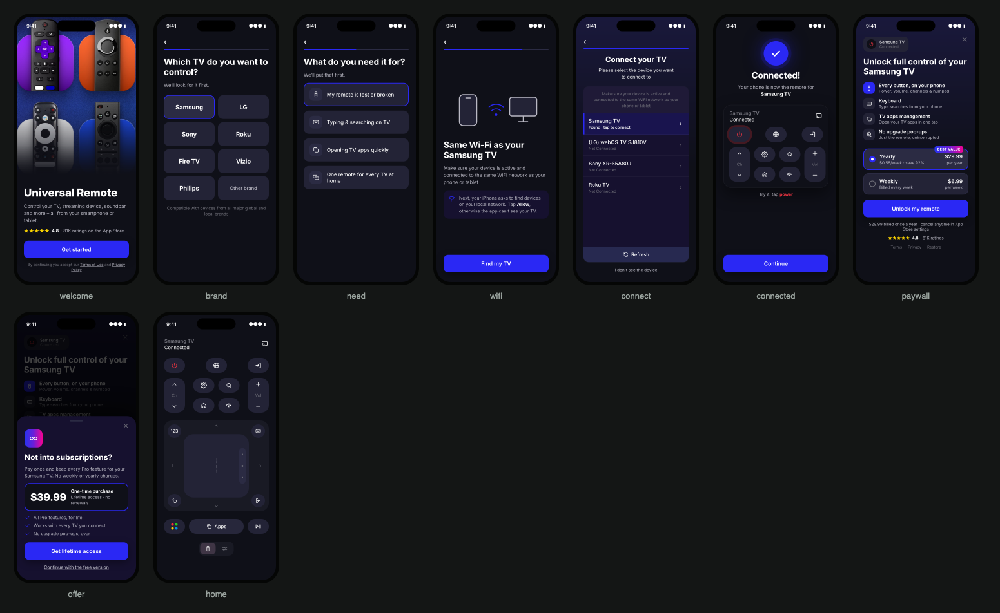

# Universal TV Remote Control — onboarding & paywall rebuild

A clickable prototype of a rebuilt onboarding and paywall for **Universal TV Remote Control** (toggle apps, iOS). Open `index.html`. It's a static page, so no build step is needed and it works on GitHub Pages as-is.

**Flow:** welcome → which TV brand → what they need it for → Wi-Fi primer → Connect your TV (their screen, picked brand first) → Connected → paywall that names their TV → lifetime offer on close → the remote.

**Thesis:** connect the TV first, then ask for money. The paywall names the TV the user just paired. Art direction, colours, type and copy come from the app's own App Store screenshots and toggleapps.io.

The page has three views:
- **Prototype**: every screen is clickable, answers carry forward, and chips jump to any screen.
- **Side panel**: the rationale for each screen, what was kept from the app, the shipping flow, and expected impact.
- **Before → After**: the ranked changes table.

**Sources & grounding** traces every price, rating and image to where it came from.

Impact ranges are Adapty's expected effect from teardowns and A/B tests across subscription apps, not measured lift for this app. The current in-app onboarding and paywall were not visible; the "before" comes from App Store reviews, the listing and category replays.
